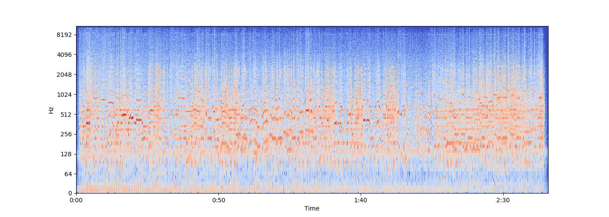

# Music Genre Classification using Spectrogram and MEL Spectrogram images

## CODE REQUIREMENTS:

**pip install requirements.txt**

## DESCRIPTION:

**This project repository detects the genre of an audio song by plotting its spectrogram and MEL spectrogram diagram. The system is trained to classify 3 types of genres - POP, ROCK and JAZZ. The system can be easily extended to other genres like EDM, metal etc. by training a model on their data.**

## IMPLEMENTATION:

**-Python 3.6**

**-Pytorch (Deep Learning)**

**-Librosa (Python audio Processing Library)**

**-Convolutional Neural Networks**

## Technique:

**Deep Residual Learning for Image Recognition.**

## Model Used:

**ResNet-50(Residual Network)**

